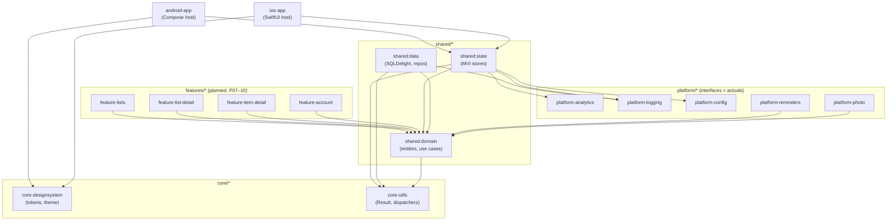

# FluxIt — Architecture

> Reference for engineers working in this repo. The high-level shape lives in
> [`MASTER_PLAN.md`](../MASTER_PLAN.md); this file expands each module's
> responsibilities, makes the dependency graph visible, and points to the
> ADRs that lock the choices in. When the architecture changes, update
> `MASTER_PLAN.md` first, then mirror the change here.

**Last updated:** 2026-05-14
**Status:** Foundation phase (Phase 01). Android + iOS app shells build green
against shared `:shared:state`. `:features:*` modules are not yet wired —
they land in Phases 07–10.

---

## 1. Layering (Clean Architecture)

Dependencies point inward. Outer rings may know about inner rings; inner
rings never reach out.

```
┌─────────────────────────────────────────────────────────────┐
│  android-app (Compose)              ios-app (SwiftUI)        │  ← Platform UI
├─────────────────────────────────────────────────────────────┤
│  feature-* (shared MVI stores, presentation models)          │  ← Shared state (P07–10)
├─────────────────────────────────────────────────────────────┤
│  domain  (entities, use cases, repository contracts)         │  ← Pure Kotlin
├─────────────────────────────────────────────────────────────┤
│  data    (SQLDelight, repositories, mappers)                 │  ← Shared
├─────────────────────────────────────────────────────────────┤
│  core-* (designsystem, utils)   platform-* (analytics,       │  ← Capability
│                                  logging, config, reminders, │
│                                  photo)                      │
└─────────────────────────────────────────────────────────────┘
```

The two UI hosts (`:android-app`, `:ios-app`) only consume `:shared:state`
(future `:features:*`) and `:core:core-designsystem`. They never reach into
`:shared:data` or `:platform:*` directly — those are wired through DI from
the `:shared:state` boundary so the UI tier stays platform-rendering-only.

Locked by [ADR-001](../plan/00_DECISIONS.md) — native UI per platform; share
domain/data/state only.

---

## 2. Module dependency graph

The graph below reflects the *target* end-of-Milestone-2 shape. Modules
marked **(planned)** are declared in `settings.gradle.kts` (or will be) but
have stub `build.gradle.kts` files until their owning phase fills them in.



**Rules the graph encodes** (and Konsist enforces; see §5):

1. `:shared:domain` has zero outgoing edges to `:shared:data`, `:platform:*`,
   or any UI module.
2. No edge connects two `:features:*` modules to each other — cross-feature
   flows go through a use case in `:shared:domain`.
3. `:platform:*` modules expose interfaces from common code; their Android
   and iOS implementations live in their own `androidMain` / `iosMain`
   source sets, not in the app modules.
4. `:core:core-designsystem` is the only module allowed to define
   color/type/spacing literals (see ADR-005, anticipated, Phase 02).

---

## 3. Modules — responsibilities

Modules grouped by tier, top-down. Each entry: **path** — *current state*
(stub vs. wired) — purpose — owning phase. Phase numbers reference files in
[`/plan`](../plan/).

### App hosts

- **`:android-app`** — *wired (Phase 01 §6)*. Compose host. Hosts
  `MainActivity`, `FluxItApp` (Koin bootstrap), navigation graph (added in
  Phase 07). Applies the `fluxit.android.application` convention plugin.
  `applicationId = dev.franzueto.fluxit` per [ADR-012](../plan/00_DECISIONS.md).
- **`:ios-app`** — *wired (Phase 01 §7)*. SwiftUI host. `FluxItApp.swift`
  + `ContentView.swift`. Consumes the shared XCFramework via the `:shared:state`
  fat-framework task. The Xcode project is **regenerated by xcodegen** from
  [`ios-app/project.yml`](../ios-app/project.yml) on every
  `scripts/build-ios.sh` run; `ios-app/FluxIt.xcodeproj` is gitignored.
  Deployment target iOS 16 per [ADR-013](../plan/00_DECISIONS.md).

### Feature stores (`/features`)

Each `feature-*` module owns the MVI store, intents, state, and effects for
one user-facing surface. They depend on `:shared:domain` for use cases and
on `:core:core-utils` for Result/dispatchers — never on each other. UI
implementations live in `:android-app` (Compose) and `:ios-app` (SwiftUI),
both consuming the same store via SKIE on iOS.

- **`:features:feature-lists`** — *planned, Phase 07*. Lists Dashboard +
  Create List composer state.
- **`:features:feature-list-detail`** — *planned, Phase 08*. List Detail:
  items, sections, completion toggle, item composer state.
- **`:features:feature-item-detail`** — *planned, Phase 10*. Edit Item +
  Photo state.
- **`:features:feature-account`** — *planned, Phase 07 stub*. v1 Account tab
  stub; minimal state for placeholder UX.

### Shared (`/shared`)

- **`:shared:state`** — *stub wired (Phase 01 §11.2/11.3)*. Cross-feature
  glue and the future home of any non-feature shared store (e.g. global
  navigation events). Currently exposes `expect class Platform` to verify
  expect/actual + iOS framework export end-to-end. **This module is the
  iOS XCFramework producer** (`assembleSharedXCFramework`); features will
  flow through it to iOS via SKIE.
- **`:shared:domain`** — *stub, fills in Phase 04*. Pure Kotlin. Entities
  (`List`, `Item`, `Reminder`, `Photo`), use cases, repository contracts.
  No Android/iOS imports — enforced by Konsist.
- **`:shared:data`** — *stub, fills in Phase 03*. SQLDelight schema +
  generated query bindings, repository implementations, mappers between
  DB rows and domain entities. Migration policy locked by anticipated
  ADR-006.

### Core (`/core`)

- **`:core:core-designsystem`** — *stub, fills in Phase 02*. Single source
  of truth for design tokens (color, type, spacing, motion). Generates the
  Compose theme directly and emits a SwiftUI mirror via the token pipeline
  (anticipated ADR-005). Only module allowed to declare visual literals.
- **`:core:core-utils`** — *stub, sanity-test in Phase 01 §11.1*. Cross-cutting
  utilities: Result extensions, dispatcher wrappers, time provider, ID
  generator. No business logic.

### Platform capability ports (`/platform`)

These modules expose Kotlin interfaces from `commonMain` and provide
Android + iOS implementations in `androidMain` / `iosMain`. App modules
bind these via Koin. The expect/actual-vs-injected-interface call is
locked by anticipated ADR-008 (likely "injected interfaces").

- **`:platform:platform-analytics`** — *stub, fills in Phase 16*. Event sink
  abstraction (Crashlytics + later analytics SDK behind one port).
- **`:platform:platform-logging`** — *stub, fills in Phase 16*. Kermit
  bridge, structured logging, optional Crashlytics non-fatal forwarding.
- **`:platform:platform-config`** — *stub, fills in Phase 16*. BuildKonfig
  values, feature flags, environment indicator.
- **`:platform:platform-reminders`** — *stub, fills in Phase 13*. WorkManager
  on Android, `UNUserNotificationCenter` on iOS, behind a single
  `RemindersPort`. Permission UX locked by anticipated ADR-009.
- **`:platform:platform-photo`** — *stub, fills in Phase 10*. CameraX on
  Android, `PHPicker` / `AVCapture` on iOS. Stores files in app sandbox;
  URIs in DB (per [ADR-003](../plan/00_DECISIONS.md), local-only v1).

### Build-logic & tooling

- **`:build-logic`** — *wired (Phase 01 §4 + §8)*. An `includeBuild` composite
  build hosting four convention plugins:
  - `fluxit.kmp.library` — `kotlin-multiplatform` + `android-library`,
    JVM target 17, three iOS targets producing static frameworks named
    after the module, SKIE applied.
  - `fluxit.kmp.feature` — extends `fluxit.kmp.library`; pre-wires Koin,
    Kermit, kotlinx-datetime, Turbine in test source sets.
  - `fluxit.android.application` — `com.android.application`, Compose,
    `applicationId = dev.franzueto.fluxit`, R8 in release.
  - `fluxit.quality` — ktlint + detekt + Spotless, applied to every
    Kotlin module.

  The Konsist architecture tests live in `:build-logic`'s own test source
  set so they run repo-wide against the resolved Gradle graph rather than
  per-module. (See §5 for the gotcha.)

---

## 4. Data flow (single source of truth)

```
SQLDelight  ──Flow──▶  Repository  ──Flow──▶  UseCase  ──▶  Store (MVI)
                                                              │
                                                              ▼
                                          State (StateFlow) ──▶ UI (Compose / SwiftUI via SKIE)
                                                              ▲
                                                              │
                                          Intent ◀── User interaction
```

- **Optimistic updates**: stores apply intent → emit optimistic state →
  invoke the use case → reconcile when the next DB Flow emission arrives.
  Errors revert via the same Flow, never via direct state mutation.
- **No `runBlocking` / `GlobalScope`** outside `*Test` source sets —
  enforced by Konsist (see §5).
- **iOS view models are not duplicated.** SwiftUI screens consume the
  Kotlin store directly through the SKIE-generated Swift surface. The
  store is the view model; SwiftUI is render-only.

The MVI store contract (intents, state, effects, error model) is locked by
anticipated **ADR-007** (Phase 05).

---

## 5. Architecture rules enforced by Konsist

Three rules currently live in
`build-logic/src/test/kotlin/dev/franzueto/fluxit/arch/ArchitectureTest.kt`:

1. **Domain purity** — files under `:shared:domain` may not import
   `android.*`, `dev.franzueto.fluxit.platform.*`, or any iOS UIKit/Foundation
   symbol.
2. **Feature isolation** — no `:features:*` module may import another
   `:features:*` module. Cross-feature flows must go through a use case
   in `:shared:domain`.
3. **No coroutine globals** — `kotlinx.coroutines.GlobalScope` and
   `kotlinx.coroutines.runBlocking` are forbidden outside source sets
   whose name ends in `Test`.

**Known gotcha:** because the Konsist tests live in `:build-logic`, Gradle
does not see code in other modules as task inputs. A scanned-but-untracked
file change can leave `:build-logic:test` reporting `UP-TO-DATE`. CI must
run `./gradlew :build-logic:test --rerun-tasks`. The pre-commit hook is
unaffected (it doesn't run Konsist).

---

## 6. Quality gates

All four gates are wired and green repo-wide as of Phase 01 §8:

| Gate     | Scope                                  | Where configured                       |
|----------|----------------------------------------|----------------------------------------|
| ktlint   | All Kotlin source sets, all modules    | `fluxit.quality` convention plugin     |
| detekt   | All Kotlin source sets, focused config | `config/detekt.yml` + `fluxit.quality` |
| Spotless | Kotlin + KTS per module; Markdown root | `fluxit.quality`; root `build.gradle.kts` |
| Konsist  | Repo-wide (graph invariants)           | `:build-logic` test source set         |

A pre-commit hook (`.githooks/pre-commit`, opt-in via
`scripts/install-hooks.sh`) auto-formats staged Kotlin/KTS/Markdown files
before they enter a commit.

**Spotless Markdown caveat:** Spotless 7.0.2's `flexmark()` step hits a
task-registration mutation conflict, so Markdown formatting is currently
just `endWithNewline` + `trimTrailingWhitespace`. Revisit when Spotless
ships a fix.

---

## 7. Locked stack (v1)

Build: Gradle KDSL + version catalog + `:build-logic` composite ·
DI: **Koin** ·
DB: **SQLDelight 2** ·
Serialization: **kotlinx.serialization** ·
Time: **kotlinx-datetime** ·
Concurrency: Coroutines / Flow ·
Logging: **Kermit** ·
iOS interop: **SKIE** ·
State: shared Flow-based **MVI** ·
Navigation: native (Navigation Compose / SwiftUI `NavigationStack`) ·
Reminders: WorkManager + `UNUserNotificationCenter` behind a shared port ·
Photo: CameraX + PHPicker behind a shared port ·
Quality: ktlint + detekt + Spotless + Konsist ·
CI: GitHub Actions matrix (Phase 15).

**Platform minimums** (locked by [ADR-013](../plan/00_DECISIONS.md)):
Android `minSdk = 26` / `compileSdk = targetSdk = 35`; iOS deployment
target `16.0`.

**Deferred to v2** (per [ADR-003](../plan/00_DECISIONS.md) and
[ADR-004](../plan/00_DECISIONS.md)): Ktor, Store5, Decompose / Voyager /
Circuit, Compose Multiplatform UI, auth, multi-device sync, Calendar tab,
Starred tab.

---

## 8. Where to look next

- [`MASTER_PLAN.md`](../MASTER_PLAN.md) — phase status, roadmap, ▶ Next Step pointer.
- [`plan/00_DECISIONS.md`](../plan/00_DECISIONS.md) — accepted ADRs and the anticipated-ADR backlog.
- [`plan/01_INITIAL_SETUP.md`](../plan/01_INITIAL_SETUP.md) — current phase checklist.
- [`docs/SCALING.md`](SCALING.md) — module ownership matrix (filled in Phase 17).
- [`docs/TEAM_GUIDELINES.md`](TEAM_GUIDELINES.md) — PR etiquette, branching, commit conventions.
