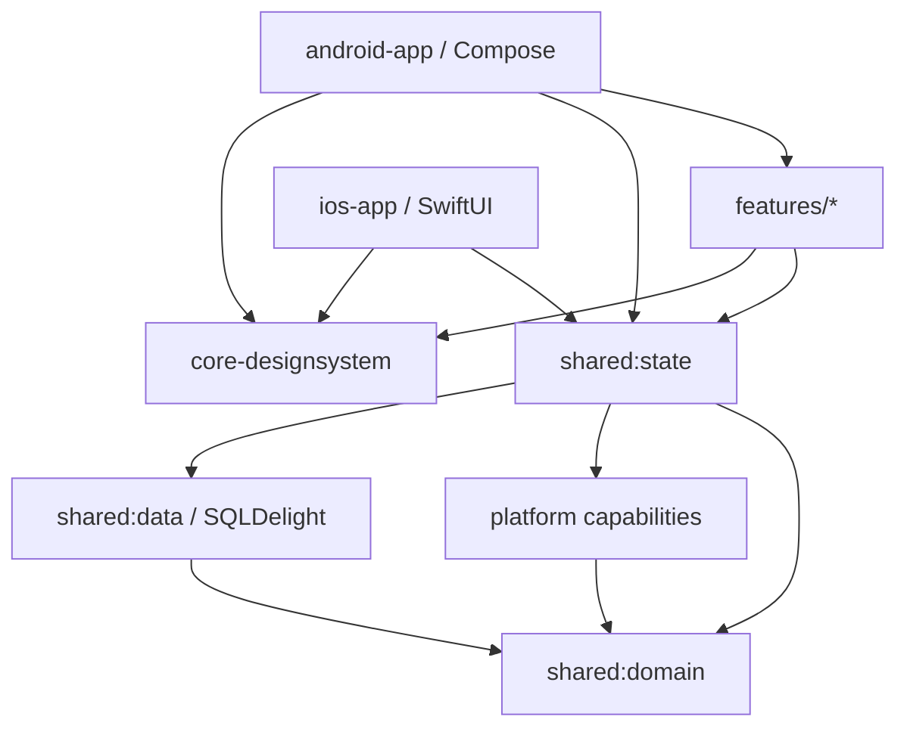

# FluxIt architecture

FluxIt demonstrates a modular Kotlin Multiplatform architecture that shares
business behavior without sharing UI. Android renders with Jetpack Compose, iOS
renders with SwiftUI, and both consume the same domain, persistence, and MVI state
layers.

## Dependency direction

Dependencies point toward stable business contracts. Platform and UI details stay
at the edges.


```mermaid
graph TD
  android["android-app / Compose"] --> features["features/*"]
  android --> state["shared:state"]
  ios["ios-app / SwiftUI"] --> state
  features --> state
  features --> design["core-designsystem"]
  state --> domain["shared:domain"]
  state --> platform["platform capabilities"]
  data["shared:data / SQLDelight"] --> domain
  state --> data
  platform --> domain
  android --> design
  ios --> design
```

The graph is intentionally more segmented than a small app requires. Its purpose
is to make ownership and dependency boundaries visible and enforceable as a team
or feature set grows.

## Modules

### Application hosts

- `:android-app` is the Android composition root. It starts Koin, wires Android
  capability hosts, owns top-level Navigation Compose routes, and hosts the
  Compose feature screens.
- `ios-app` is the SwiftUI composition root. It starts the shared Koin graph,
  observes shared stores through SKIE, and owns native iOS navigation and system
  presentation.

### Feature UI

The modules under `features/` contain Android UI for a user-facing surface:

- `:features:feature-lists`
- `:features:feature-list-detail`
- `:features:feature-create-list`
- `:features:feature-item-detail`

Feature modules may depend on shared state and the design system, but not on one
another. Cross-feature behavior belongs in shared stores or domain use cases.
SwiftUI screens live in `ios-app/Sources` and consume the same shared stores.

### Shared layers

- `:shared:domain` owns entities, validation rules, use cases, repository
  contracts, and capability ports. It has no Android, iOS, database, or UI
  dependencies.
- `:shared:data` owns the SQLDelight schema, query bindings, mappers, migrations,
  and repository implementations.
- `:shared:state` owns Flow-based MVI stores, application initialization,
  navigation effects, error presentation mapping, and the Koin composition graph.
  It also produces the XCFramework consumed by iOS.
- `:shared:domain-testing` provides reusable fakes and recording implementations
  for domain and state tests.

### Core and platform capabilities

- `:core:core-designsystem` owns design tokens, generated icons, Compose
  components, and the generated SwiftUI token mirror.
- `:core:core-utils` contains small cross-cutting utilities with no business
  policy.
- `:platform:platform-analytics`, `platform-logging`, `platform-config`,
  `platform-reminders`, and `platform-photo` implement capability contracts from
  the domain layer. Platform-specific code remains in `androidMain` and `iosMain`.

### Build logic

`build-logic` contains convention plugins for Android applications, KMP libraries,
feature modules, quality checks, token generation, and icon generation. It also
hosts repository-wide architecture tests.

## State and data flow

```text
User action
    │
    ▼
Native UI ──Intent──▶ Shared store ──▶ Use case ──▶ Repository ──▶ SQLDelight
    ▲                      │                                      │
    │                      └──────── State / Effect ◀── Flow ─────┘
    └──────── Compose StateFlow / Swift AsyncSequence ────────────
```

Stores expose renderable state through `StateFlow` and one-shot navigation or
message events through an effects `Flow`. Mutations go through use cases and
repositories. SQLDelight flows reconcile persisted state after optimistic UI
updates, keeping the database as the source of truth.

iOS does not duplicate view models. SwiftUI observes the shared store through
SKIE and translates effects into native navigation or system presentation.

## Enforced boundaries

Konsist tests under `build-logic/src/test` enforce the most important dependency
rules, including:

1. Domain code cannot import Android, iOS, platform implementation, data, state,
   or UI packages.
2. Feature modules cannot import other feature modules.
3. State stores expose the shared store contract rather than ad hoc public APIs.
4. Platform capability modules remain isolated from application and feature UI.
5. Global coroutine scopes and blocking coroutine entry points are rejected in
   production source sets.
6. Feature UI uses the design system instead of introducing arbitrary visual
   literals.

When changing module relationships, update both Gradle dependencies and the
corresponding architecture test. Run:

```bash
./gradlew :build-logic:test --rerun-tasks
```

The explicit rerun matters because source files outside the included build are not
always visible to Gradle as inputs to the architecture-test task.

## Cross-platform design system

`core/core-designsystem/tokens/tokens.json` is the source of truth for design
tokens. Gradle generators emit Compose Kotlin sources and a Swift token mirror.
SVGs under `core/core-designsystem/icons/` similarly generate Compose
`ImageVector` APIs and iOS asset-catalog entries.

Generated files are build outputs and should not be edited. Change the token JSON
or SVG source and regenerate through the design-system tasks or the normal app
build.

## Platform boundaries

System capabilities are expressed as domain-facing ports and supplied by
platform modules:

- Reminders use WorkManager on Android and `UNUserNotificationCenter` on iOS.
- Photo capture and storage use platform-native presentation and sandbox storage.
- Logging, analytics, clock, identifiers, and configuration are injected so
  business logic remains deterministic and testable.

Some capabilities require a native UI host. Android attaches an
`ActivityResultRegistry` provider at the application boundary; iOS resolves the
top presented view controller. These details do not leak into the shared domain
contracts.

## Deliberate scope

The app is offline-first and stores data locally. Repository interfaces remain
asynchronous and implementation-agnostic, so a future sync implementation can be
introduced without moving persistence concerns into UI or domain code.

Calendar, Starred, authentication, networking, and multi-device sync are not part
of the current implemented product. Their eventual shape should be decided from
validated requirements rather than assumed by this architecture.

See [`DECISIONS.md`](DECISIONS.md) for the rationale behind the major choices and
[`TEAM_GUIDELINES.md`](TEAM_GUIDELINES.md) for repository working agreements.
